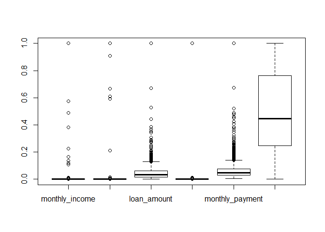
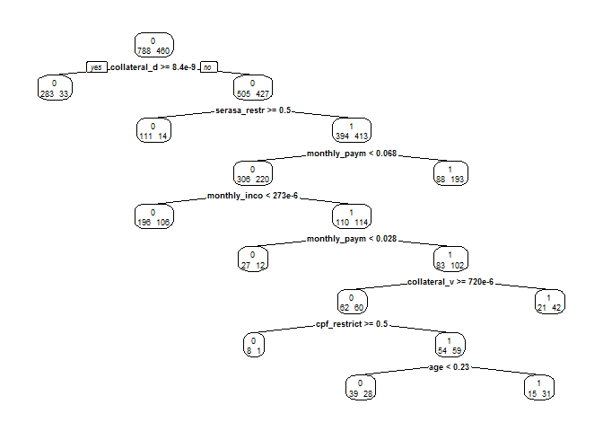
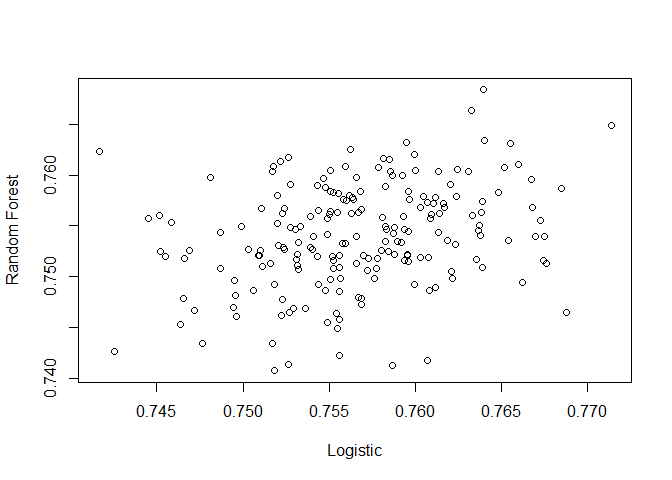

Introdução
----------

O objetivo deste projeto é dizer qual a probabilidade de um cliente passar com sucesso para análise de crédito dado que ele foi pré-aprovado para o empréstimo com garantia de automóvel.

Neste estudo de caso, vamos tentar discutir algumas maneiras de prever a chance de um cliente específico, que quer candidatar-se a um empréstimo, será padrão em seus pagamentos (ou não).

Em primeiro lugar, "prever" algo é uma expressão realmente estranha, não é? É provável que as pessoas comuns liguem a "previsão" com o relatório meteorológico diário - e todos sabemos que esse tipo de previsão não é confiável o tempo todo.

Então, por que fazer o esforço tentar olhar para o futuro para estimar a probabilidade de inadimplência? Por que os bancos simplesmente não dão a alguém que precise de algum dinheiro sabendo que eles não podem fazer nada para reduzir os mal devedores?

É claro que não é assim que isso funciona - a maneira mais intuitiva (e ainda muito popular) é que um oficial de empréstimo qualificado e experiente faça o melhor para decidir se um candidato é aprovado - ou não.

### Carregando o Dataset

A carga do dataset no formato `csv` deve passar por uma transformação inicial quanto a coluna `bi_lead_id` simplesmente por simples inconsistência quanto a coerção. Transformamos em caractere.

``` r
df <- read.csv("data/auto_refi_loan_data.csv",encoding = "UTF-8", stringsAsFactors = FALSE) 
head(df[,1:6])
```

    ##   X  bi_lead_id age monthly_income collateral_value loan_amount
    ## 1 1 1.00001e+11  61           1300               NA       10000
    ## 2 2 1.73466e+05  50           3500            40000       23936
    ## 3 3 1.73465e+05  31           2600            18000        5000
    ## 4 4 1.73464e+05  51           3600            21000       10000
    ## 5 5 1.73463e+05  51           1500            10000        8000
    ## 6 6 1.73462e+05  25           4000            39000       10000

**Estrutura do Dataset**

A coluna de descrição foi truncada para melhor visualização

``` r
structure <- read.csv("data/dataset_description.csv", header = FALSE, col.names = c("coluna","descricao"),encoding = "UTF-8")
structure$descricao <- strtrim(structure$descricao,width = 45)
structure
```

    ##                      coluna                                     descricao
    ## 1                bi_lead_id     Chave única de uma solicitação de cliente
    ## 2                       age                             Idade do cliente 
    ## 3            monthly_income Renda mensal informada pelo cliente no moment
    ## 4          collateral_value  Valor do automóvel que será dado em garantia
    ## 5               loan_amount Valor solicitado pelo cliente para empréstimo
    ## 6                      city                             Cidade do cliente
    ## 7                     state                             Estado do cliente
    ## 8    collateral_debt_amount Valor que o automovel do cliente tem de dívid
    ## 9        serasa_restriction Indica se o cliente possui alguma pendência n
    ## 10 serasa_dishonored_checks Indica se o cliente possui cheques sem fundo 
    ## 11     serasa_expired_debts Indica se o cliente possui dívidas vencidas (
    ## 12     serasa_banking_debts Indica se o cliente possui divídas bancárias 
    ## 13  serasa_commercial_debts Indica se o cliente possui dividas comerciais
    ## 14          serasa_protests Indica se o cliente possui protestos (dado da
    ## 15           marital_status                                 Estado civil 
    ## 16          cpf_restriction     Restrição no cpf (informado pelo cliente)
    ## 17                loan_term                           Prazo do empréstimo
    ## 18          monthly_payment                Pagamento mensal do empréstimo
    ## 19                  purpose Motivo pelo qual o cliente deseja o empréstim
    ## 20               auto_brand                                Marca do carro
    ## 21               auto_model                               Modelo do carro
    ## 22          auto_model_year                                  Ano do carro
    ## 23             covered_lead Lead pré-aprovado (apenas leads pré-aprovados
    ## 24           form_completed         Ficha cadastral completa pelo cliente
    ## 25         sent_to_analysis               Enviado para análise de crédito
    ## 26           discard_reason Motivo de descarte de um lead (leads pré-apro
    ## 27                  channel                      Canal de entrada do lead
    ## 28         created_at_safra                       Data de criação do lead
    ## 29                 zip_code                                CEP do cliente
    ## 30             landing_page  Página inicial que o cliente acessou no site
    ## 31     landing_page_product          Produto da página inicial do cliente
    ## 32                   gender                             Gênero do cliente
    ## 33          education_level                  Grau de instrução do cliente
    ## 34                 utm_term Tipo de dispositivo do cliente (c = computer,

Limpeza e transformação dos dados
---------------------------------

Algumas ações são necessárias, como por exemplo, a limpeza e transformação de algumas variáveis categóricas para inteiros ou numéricas de ponto flutuante. Também excluimos todas as observações cujo valor da variáel `covered_lead` seja igual a zero e os formulários incompletos.

``` r
library(gmodels)
df$bi_lead_id <- as.character(df$bi_lead_id) # adequando a variável (transofrmação)
ndf <- subset(df,covered_lead != "0")
ndf <- subset(ndf,form_completed != "0")
## trocando valores não disponíveis por zero nas colunas 
## collateral_debt_amount e monthly_payment
ndf[is.na(ndf)] <- 0
```

A coluna `purpose` é uma string com muitas váriações, o ideal é que o dado tivesse sido padronizado em sua coleta, já que isso aconteceu via portal na Internet. Vamos tentar melhorar com alguns ajustes. Vamos olhar um pequeno exemplo:

``` r
ndf$purpose[20:30]
```

    ##  [1] "NEGOCIAR DIVIDAS"             "Quitar dívidas"              
    ##  [3] "para pagar contas"            "Pagar dívidas "              
    ##  [5] "quitar dividas"               "Pagar dividas"               
    ##  [7] "Quitar empréstimo bancário "  "Para fins de saúde."         
    ##  [9] "Pagamento de dividas"         "Terminar a minha lanchonete "
    ## [11] "PAGAMENTO DÍVIDAS "

*quitar dividas* é um bom exemplo, vamos retirar os espaços duplos ou maiores, deixar todo o texto em caixa baixa e remover toda a pontuação do texto. Vamos remover as acentuações, já que alguns clientes colocam e outros não.

``` r
ndf$purpose <- as.factor(tolower(ndf$purpose))
ndf$purpose <- gsub("^ *|(?<= ) | *$", "", ndf$purpose, perl = TRUE)
rm_accent <- function(str,pattern="all") {
  # rm.accent - REMOVE ACENTOS DE PALAVRAS
  # Função que tira todos os acentos e pontuações de um vetor de strings.
  # Parâmetros:
  # str - vetor de strings que terão seus acentos retirados.
  # patterns - vetor de strings com um ou mais elementos indicando quais acentos deverão ser retirados.
  #            Para indicar quais acentos deverão ser retirados, um vetor com os símbolos deverão ser passados.
  #            Exemplo: pattern = c("´", "^") retirará os acentos agudos e circunflexos apenas.
  #            Outras palavras aceitas: "all" (retira todos os acentos, que são "´", "`", "^", "~", "¨", "ç")
  if(!is.character(str))
    str <- as.character(str)

  pattern <- unique(pattern)

  if(any(pattern=="Ç"))
    pattern[pattern=="Ç"] <- "ç"

  symbols <- c(
    acute = "áéíóúÁÉÍÓÚýÝ",
    grave = "àèìòùÀÈÌÒÙ",
    circunflex = "âêîôûÂÊÎÔÛ",
    tilde = "ãõÃÕñÑ",
    umlaut = "äëïöüÄËÏÖÜÿ",
    cedil = "çÇ"
  )

  nudeSymbols <- c(
    acute = "aeiouAEIOUyY",
    grave = "aeiouAEIOU",
    circunflex = "aeiouAEIOU",
    tilde = "aoAOnN",
    umlaut = "aeiouAEIOUy",
    cedil = "cC"
  )

  accentTypes <- c("´","`","^","~","¨","ç")

  if(any(c("all","al","a","todos","t","to","tod","todo")%in%pattern)) # opcao retirar todos
    return(chartr(paste(symbols, collapse=""), paste(nudeSymbols, collapse=""), str))

  for(i in which(accentTypes%in%pattern))
    str <- chartr(symbols[i],nudeSymbols[i], str)

  return(str)
}

ndf$purpose <- rm_accent(ndf$purpose)
ndf$purpose[20:30]
```

    ##  [1] "negociar dividas"            "quitar dividas"             
    ##  [3] "para pagar contas"           "pagar dividas"              
    ##  [5] "quitar dividas"              "pagar dividas"              
    ##  [7] "quitar emprestimo bancario"  "para fins de saude."        
    ##  [9] "pagamento de dividas"        "terminar a minha lanchonete"
    ## [11] "pagamento dividas"

Agora podemos transformar essa coluna em numérica devido aos seus nívels (fatores). O mesmo para outras variáveis.

``` r
ndf$purpose <- as.factor(ndf$purpose)
ndf$purpose <- as.integer(unclass(ndf$purpose))
ndf$education_level <- as.factor(ndf$education_level)
ndf$education_level <- as.integer(unclass(ndf$education_level))

# transformando marital_status
ndf$marital_status <- as.integer(ndf$marital_status)
```

Vamos então retirar algumas colunas para um novo dataset para o processamento, como por exemplo a cidade onde o cliente mora, esses valores não interferem no resultado final.

``` r
credit <- ndf
credit[,c(1,2,7,8,18,21:25,27:33,35,36)] <- NULL
ndf[is.na(ndf)] <- 0
dim(credit)[1]
```

    ## [1] 4172

``` r
#remove(ndf)
```

``` r
summary(credit[,c(1:5,14:16,17)])
```

    ##       age         monthly_income     collateral_value    loan_amount    
    ##  Min.   : 18.00   Min.   :     800   Min.   :      27   Min.   :  2500  
    ##  1st Qu.: 30.00   1st Qu.:    2800   1st Qu.:   18000   1st Qu.:  7000  
    ##  Median : 37.00   Median :    4000   Median :   24000   Median : 12310  
    ##  Mean   : 38.84   Mean   :   14541   Mean   :   53686   Mean   : 15550  
    ##  3rd Qu.: 46.00   3rd Qu.:    6700   3rd Qu.:   34000   3rd Qu.: 20000  
    ##  Max.   :115.00   Max.   :11000000   Max.   :27000000   Max.   :288000  
    ##  collateral_debt_amount monthly_payment      purpose      
    ##  Min.   :       0       Min.   :    0.0   Min.   :   1.0  
    ##  1st Qu.:       0       1st Qu.:  365.9   1st Qu.: 609.8  
    ##  Median :       0       Median :  580.6   Median :1105.0  
    ##  Mean   :    4880       Mean   :  725.6   Mean   :1188.9  
    ##  3rd Qu.:      10       3rd Qu.:  891.1   3rd Qu.:1888.2  
    ##  Max.   :10100000       Max.   :12000.0   Max.   :2471.0  
    ##  sent_to_analysis education_level
    ##  Min.   :0.00     Min.   : 1.00  
    ##  1st Qu.:0.00     1st Qu.: 7.00  
    ##  Median :0.00     Median : 8.00  
    ##  Mean   :0.36     Mean   : 7.34  
    ##  3rd Qu.:1.00     3rd Qu.:10.00  
    ##  Max.   :1.00     Max.   :12.00

Nesta fase vamos apenas entender se existe valores do tipo outliers. Não vamos avaliar as medidas de tendência central da coluna `sent_to_analysis`. Observando os valores acima é fácil perceber que alguns clientes digitaram informações aparentemente inconsistentes, como por exemplo, o `monthly_payment`. Valores zero e outros muito acima da média, o que podemos considerar outliers. O mesmo vale para a idade. O mesmo ocorre com `loan_term`, vamos retirar esses valores faltantes.

**Normalizando as variáveis**

A solução abaixo permite escalar apenas nomes de variáveis específicas, preservando outras variáveis inalteradas (e os nomes das variáveis podem ser gerados dinamicamente), mas optamos aqui por seu indice específico.

``` r
standValue <- function(x){(x-min(x))/(max(x)-min(x))}
credit$monthly_income <- standValue(credit$monthly_income)
credit$collateral_value <- standValue(credit$collateral_value)
credit$loan_amount <- standValue(credit$loan_amount)
credit$collateral_debt_amount <- standValue(credit$collateral_debt_amount)
credit$monthly_payment <- standValue(credit$monthly_payment)
credit$purpose <- standValue(credit$purpose)
credit$age <- standValue(credit$age)
credit$education_level <- standValue(credit$education_level)
credit$monthly_payment <- standValue(credit$monthly_payment)

summary(credit[,c(1:5,14:16,17)])
```

    ##       age         monthly_income      collateral_value   
    ##  Min.   :0.0000   Min.   :0.0000000   Min.   :0.0000000  
    ##  1st Qu.:0.1237   1st Qu.:0.0001818   1st Qu.:0.0006657  
    ##  Median :0.1959   Median :0.0002909   Median :0.0008879  
    ##  Mean   :0.2148   Mean   :0.0012493   Mean   :0.0019874  
    ##  3rd Qu.:0.2887   3rd Qu.:0.0005364   3rd Qu.:0.0012583  
    ##  Max.   :1.0000   Max.   :1.0000000   Max.   :1.0000000  
    ##   loan_amount      collateral_debt_amount monthly_payment  
    ##  Min.   :0.00000   Min.   :0.0000000      Min.   :0.00000  
    ##  1st Qu.:0.01576   1st Qu.:0.0000000      1st Qu.:0.03049  
    ##  Median :0.03436   Median :0.0000000      Median :0.04838  
    ##  Mean   :0.04571   Mean   :0.0004832      Mean   :0.06046  
    ##  3rd Qu.:0.06130   3rd Qu.:0.0000010      3rd Qu.:0.07426  
    ##  Max.   :1.00000   Max.   :1.0000000      Max.   :1.00000  
    ##     purpose       sent_to_analysis education_level 
    ##  Min.   :0.0000   Min.   :0.00     Min.   :0.0000  
    ##  1st Qu.:0.2465   1st Qu.:0.00     1st Qu.:0.5455  
    ##  Median :0.4470   Median :0.00     Median :0.6364  
    ##  Mean   :0.4809   Mean   :0.36     Mean   :0.5764  
    ##  3rd Qu.:0.7641   3rd Qu.:1.00     3rd Qu.:0.8182  
    ##  Max.   :1.0000   Max.   :1.00     Max.   :1.0000

Agora com os dados normalizados passamos para a próxima fase.

### Fase exploratória

Agora vamos identificar os clientes que já foram enviados para análise de crédito. Esses clientes serão usados para testar o modelo.

``` r
dim(subset(credit,credit$sent_to_analysis > 0))[1]
```

    ## [1] 1502

Observa-se que apenas 4172 clientes que não tem restrições no Serasa, sendo que desses 1502 ainda não foram enviados para a análise de crédito.

### Aprimorando a limpeza e tratamento dos dados

Registros sem valores de Pagamento mensal do empréstimo são retirados.

**monthly\_payment**

``` r
head(credit[order(credit$monthly_payment,decreasing = TRUE),c(1:4)])
```

    ##             age monthly_income collateral_value loan_amount
    ## 2816  0.2371134    0.003563896     0.0166656881   1.0000000
    ## 11054 0.2577320    0.009018838     0.0062953074   0.5271454
    ## 8632  0.3505155    0.002427449     0.0079619757   0.6690018
    ## 22595 0.3092784    0.001745581     0.0021841922   0.1772329
    ## 25826 0.2268041    0.000381846     0.0009249317   0.0262697
    ## 34693 0.2989691    0.001745581     0.0030568597   0.1663748

``` r
credit <- subset(credit,credit$monthly_payment != 0)
```

``` r
head(credit[order(credit$collateral_value,decreasing = TRUE),c(1:4)])
```

    ##              age monthly_income collateral_value loan_amount
    ## 33736 0.24742268   1.701033e-04        1.0000000 0.026269702
    ## 5507  0.05154639   2.909302e-04        0.9074073 0.026269702
    ## 22443 0.14432990   3.636628e-05        0.6666663 0.008756567
    ## 27610 0.19587629   2.909302e-04        0.6111107 0.008756567
    ## 2907  0.23711340   1.090988e-04        0.5926197 0.015761821
    ## 27593 0.43298969   8.364245e-04        0.2111103 0.230784799

Os valores acima ordenados por `collateral_value` mostram que o valor máximo é um outlier. o gráfico de dispersão confirma essa suspeita. Devemos observa que o segundo item da lista foi enviado para análise de crédito, então não podemos considerá-lo como outlier.

Comparando todas as variáveis com e sem os outliers

``` r
boxplot(credit[,c(2:5,14:15)])
```



``` r
boxplot(credit[,c(2:5,14:15)],outline = FALSE)
```


``` r
par(mfrow = c(1,5))
plot(credit$age, ylab = structure[2,2], xlab = "Clientes")
plot(credit$collateral_value, ylab = structure[4,2], xlab = "Clientes")
plot(credit$collateral_debt_amount, ylab = structure[8,2], xlab = "Clientes")
plot(credit$monthly_payment, ylab = structure[18,2], xlab = "Clientes")
plot(credit$monthly_income, ylab = structure[3,2], xlab = "Clientes")
```


Apesar dos valores estarem longe dos demais, há coerência entre `collateral_value`e `monthly_income`, pois os valores são muito distante dos demais.

Vamos então retirar todos os outliers para verificar o seu comportamento, mas antes vamos fazer uma cópia dos nossos dados.

``` r
## Função para remover outliers
remove_outliers <- function(x, na.rm = TRUE, ...) {
  qnt <- quantile(x, probs=c(.25, .75), na.rm = na.rm, ...)
  H <- 1.5 * IQR(x, na.rm = na.rm)
  y <- x
  y[x < (qnt[1] - H)] <- NA
  y[x > (qnt[2] + H)] <- NA
  y
}

credit2 <- credit
credit$collateral_value <- remove_outliers(credit$collateral_value)
credit$collateral_debt_amount <- remove_outliers(credit$collateral_debt_amount)
credit$monthly_payment <- remove_outliers(credit$monthly_payment)
credit$monthly_income <- remove_outliers(credit$monthly_income)

par(mfrow = c(1,5))
plot(credit$age, ylab = structure[2,2], xlab = "Clientes")
plot(credit$collateral_value, ylab = structure[4,2], xlab = "Clientes")
plot(credit$collateral_debt_amount, ylab = structure[8,2], xlab = "Clientes")
plot(credit$monthly_payment, ylab = structure[18,2], xlab = "Clientes")
plot(credit$monthly_income, ylab = structure[3,2], xlab = "Clientes")
```


``` r
credit <- credit2
remove(credit2)
```

Agora temos uma dispersão sem outliers, mas isso é apenas para demonstrar, pois não vamos retirar esses valores de nosso modelo.

``` r
head(credit[order(credit$monthly_income,decreasing = TRUE),c(1:4)],10)
```

    ##              age monthly_income collateral_value loan_amount
    ## 3322  0.04123711      1.0000000     0.0005545609 0.038528897
    ## 10677 0.39175258      0.5737872     0.0004434497 0.029071804
    ## 22362 0.36082474      0.4872354     0.0009249317 0.070052539
    ## 2053  0.28865979      0.3817732     0.0004434497 0.029071804
    ## 29190 0.23711340      0.2272165     0.0012212283 0.095271454
    ## 33164 0.17525773      0.1635755     0.0005545609 0.026269702
    ## 33538 0.34020619      0.1635755     0.0008693761 0.008756567
    ## 28685 0.11340206      0.1363008     0.0016286361 0.129947461
    ## 28712 0.02061856      0.1181179     0.0009249317 0.008756567
    ## 15446 0.09278351      0.1090261     0.0002582643 0.008756567

O terceiro item da tabela acima já enviado para análise, então não vamos considerar esses elementos distantes como outliers.

Agora temos nosso banco de dados e nós sabemos como parece.

Método Um: Regressão Logística
------------------------------

O primeiro passo é criar nosso conjunto de dados de treinamento e nosso conjunto de dados de teste. O conjunto de teste é usado para avaliar a precisão do modelo.

Vamos criar vários modelos, por isso é necessário dar-lhes designações numéricas (1, 2, 3, etc.). Podemos quebrar os conjuntos de dados em todos os tamanhos que desejamos, até 50-50, mas aqui usamos uma divisão de um terço e dois terços, pois é o mais recomendado pela literatura.

Nesta fase, realizaremos uma regressão logística usando a função glm(). Começamos com o conjunto de práticas, i\_calibration1. Aqui, seremos seletivos com as variáveis que usamos no modelo. Vamos mudar isso um pouco, mas, por enquanto, usaremos apenas cinco para determinar o valor da credibilidade.

**OBS:** retiramos do modelo a variável e `marital_status` e `education_level`, essa variável deixa o modelo instável e *uma predição a partir de um ajuste `rank-deficient` pode ser enganoso*.

``` r
credit[is.na(credit)] <- 0
i_test1 <- sort(sample(1:nrow(credit), size = dim(credit)[1]*.7))

i_calibration1 <- (1:nrow(credit))[-i_test1]
set.seed(1)
LogisticModel.1 <- glm(sent_to_analysis ~ .  -marital_status -education_level, 
                       family = poisson(link = "log"),data = credit[i_calibration1, ])
```

Com isso, podemos avançar para ajustar o modelo que acabamos de criar para o conjunto de testes, i\_test1, e nos preparar para fazer nossa primeira previsão.

``` r
fitLog1 <- predict(LogisticModel.1, type = 'response', newdata = credit[i_test1, ])
```

Nós montamos nosso modelo. Agora, usaremos o pacote ROCR para criar previsões e medir o desempenho em termos de área sob a curva (AUC). Quanto maior a medida da AUC, melhor será o nosso modelo.

``` r
library(ROCR)
pred1 <- prediction(fitLog1, credit$sent_to_analysis[i_test1])
perf1 <- performance(pred1, 'tpr', 'fpr')
plot(perf1,colorize=TRUE,print.cutoffs.at=seq(0,1,by=0.1), text.adj=c(-0.2,1.7))
```


E iremos envolver esta parte ao encontrar a AUC.

``` r
AUCLog1 <- performance(pred1, measure = 'auc')@y.values[[1]]
AUCLog1
```

    ## [1] 0.7473383

Esse não é um resultado ruim, mas vamos ver se podemos fazer melhor com um método diferente.

Método dois: árvore de regressão
--------------------------------

Em seguida, vamos tentar analisar os dados usando uma abordagem de árvore de regressão. Grande parte do nosso código é semelhante ao que foi usado nos modelos de logística acima, mas precisamos fazer alguns ajustes.

Observe novamente que estamos analisando todas as variáveis em nosso modelo para encontrar seu impacto em nossa variável de interesse, credibilidade (sent\_to\_analysis).

O pacote `rpart`é usado para Árvores de particionamento e regressão recursivas. Completando os recursos necessário, o pacote `rpart.plot`será usado para plotar o gráfico.

Temporáriamente a coluna `sent_to_analysis`será transofmrada em categórica, pois a biblioteca rpart usa dessa forma.

``` r
library(rpart)
set.seed(1)
credit$sent_to_analysis <- as.factor(credit$sent_to_analysis)
TreeModel <- rpart(sent_to_analysis ~ ., data = credit[i_calibration1, ])
library(rpart.plot)
prp(TreeModel, type = 2, extra = 1)
```



``` r
fitTree <- predict(TreeModel, newdata = credit[i_test1, ], type = 'prob')[, 2]
pred3 <- prediction(fitTree, credit$sent_to_analysis[i_test1])
perf3 <- performance(pred3, 'tpr', 'fpr')
plot(perf3,colorize=TRUE,print.cutoffs.at=seq(0,1,by=0.1), text.adj=c(-0.2,1.7))
```


``` r
AUCTree <- performance(pred3, measure = 'auc')@y.values[[1]]
AUCTree
```

    ## [1] 0.7280396

O resultado foi pior do que o anterior. E ambos não são resultados satisfatórios, dada a complexidade do nosso modelo de árvore, então, novamente, temos que nos perguntar se não estamos melhor usando o modelo de Regressão Logística mais simples do primeiro modelo.

Método três: floresta aleatória (Random Forest)
-----------------------------------------------

Em vez de construir uma árvore de decisão, podemos usar o método Random Forest para criar uma "floresta" metafóra de árvores de decisão. Neste método, o resultado final é o modo das classes (se trabalharmos em um modelo de classificação) ou a média das previsões (se estiver trabalhando com regressões).

A idéia por trás da floresta aleatória é que as árvores de decisão são propensas a superação, então encontrar a árvore "média" na floresta pode ajudar a evitar esse problema.

``` r
library(randomForest)
set.seed(1)
RF <- randomForest(sent_to_analysis ~ . , data = credit[i_calibration1, ])
fitForest1 <- predict(RF, newdata = credit[i_test1, ], type = 'prob')[, 2]
pred4 <- prediction(fitForest1, credit$sent_to_analysis[i_test1])
perf4 <- performance(pred4, 'tpr', 'fpr')
plot(perf4,colorize=TRUE,print.cutoffs.at=seq(0,1,by=0.1), text.adj=c(-0.2,1.7))
```


Agora vamos avaliar o desempenho

``` r
AUCRF <- performance(pred4, measure = 'auc')@y.values[[1]]
AUCRF
```

    ## [1] 0.7554939

Com o esforço extra, ainda assim não obtemos um resultado um tanto melhorado. O modelo de Regressão logística é o melhor desempenho até o momento.

Método quarto: Comparando florestas aleatórias com modelos logísticos
---------------------------------------------------------------------

Analisamos vários resultados usando dois métodos básicos de análise - regressões logísticas e árvores de decisão. Verificamos apenas resultados individuais expressos como AUC.

A abordagem da floresta aleatória exige que criemos uma floresta de árvores de decisão e assumimos o modo ou a média. Por que não fazer uso de todos esses dados? Como eles se parecem?

O código a seguir cria um gráfico que representa centenas de combinações de pontuações AUC para cada árvore em nossa floresta aleatória e para modelos logísticos.

Primeiro precisamos de uma função para realizar a análise.

**OBS: para esse modelo vamos deixar todas as variáveis no modelo.**

``` r
AUC <- function(i){
        set.seed(i)
        i_test2 <<- sample(1:nrow(credit), size = dim(credit)[1]*.7)
        i_calibration2 <<- (1:nrow(credit))[-i_test2]
        # vamos criar esse modelo no ambiente global, pois vamos usa-lo mais na frente
        LogisticModel.3 <<- glm(sent_to_analysis ~ ., family = binomial, data = credit[i_calibration2, ])
        summary(LogisticModel.3)
        fitLog3 <- predict(LogisticModel.3, type = 'response', newdata = credit[i_test2, ])
        library(ROCR)
        pred5 <- prediction(fitLog3, credit$sent_to_analysis[i_test2])
        AUCLog3 <- performance(pred5, measure = 'auc')@y.values[[1]]
        RF <- randomForest(sent_to_analysis ~ ., data = credit[i_calibration2, ])
        fitForest2 <- predict(RF, newdata = credit[i_test2, ], type = 'prob')[, 2]
        pred6 <- prediction(fitForest2, credit$sent_to_analysis[i_test2])
        AUCRF <- performance(pred6, measure = 'auc')@y.values[[1]]
        return(c(AUCLog3, AUCRF))
}
```

Esta parte do código leva um tempo para ser executado porque estamos tabulando e gravando centenas de resultados individuais. Você pode ajustar o número de resultados no modelo alterando a contagem no objeto VAUC. Aqui, escolhemos calcular 100 x-y pares, ou 200 resultados individuais.

Normalmente `markdown` não é usado para relatórios longos ou demorados, mas para essa demanda o processo foi realizado aqui mesmo.

``` r
VAUC <- Vectorize(AUC)(1:200)
plot(t(VAUC), xlab = 'Logistic', ylab = 'Random Forest')
```



É possível verificar que os resultados que temos dos primeiros quatro modelos estão bem no meio da distribuição.

Isso confirma para nós os modelos são bastante comparáveis. O melhor que podemos esperar é uma AUC de 0,77 e a maioria nos dá resultados semelhantes ao que já calculamos.

Mas vamos tentar visualizar um pouco melhor. Um par de pacotes R pode ser usado para melhorar a representação gráfica dos resultados. Isso nos mostrará exatamente onde o conjunto de resultados mais provável reside.

Primeiro, precisamos converter nosso objeto VAUC em um Data Frame.

``` r
AA <- as.data.frame(t(VAUC))
```

Vamos usar as bibliotecas `ggplot2` e `hdrcde` para criar alguns gráficos. O primeiro é um gráfico de contorno de densidade.

``` r
library(ggplot2)
data(AA, package = 'MASS')
ggplot(AA, aes(x = V1, y = V2)) + geom_point() + geom_density2d() + xlab('Logistic') + ylab('Random Forest')
```


O segundo é um gráfico de contorno de alta densidade que nos dá as regiões de probabilidade para os dados.

``` r
library("hdrcde")
par(mar = c(3.1, 4.1, 1.1, 2.1))
with(AA, hdr.boxplot.2d(V1, V2, show.points = TRUE, prob = c(.01, .05, .5, .75), xlab = 'Logistic', ylab = 'Random Forest'))
```


De qualquer maneira que descrevemos nossos resultados, temos que usar os dados para tomar uma decisão de empréstimo, há um problema aqui?

Estas podem ser as melhores pontuações que podemos encontrar com esses modelos, mas os resultados são aceitáveis para determinar o mérito do credor? Isso depende dos padrões de crédito utilizados pela instituição de crédito.

Na melhor das hipóteses, parece que nossos modelos nos dão 82% de chance de emprestar a bons riscos de crédito. Por cada R$ 1 milhão em empréstimos, na melhor das hipóteses, podemos esperar que seja reembolsado R$ 820.000. Em média, esperamos recuperar cerca de R$ 780 mil em principal. Em outras palavras, de acordo com nossa análise, há entre 75% e 80% de chance de recuperar nosso empréstimo de US R$ 1 milhão, dependendo do método de modelagem que usamos.

À medida que adicionamos candidatos de empréstimo a nossas bases de dados, gostaríamos que eles se agrupassem na área mais escura do gráfico de alta densidade se considerarmos bons riscos de crédito.

A menos que cobramos muito interesse para cobrir nossas perdas, talvez precisemos de melhores modelos.

Como há muitas possíveis variáveis para o modelo, podemos proceder com a abordagem de Stepwise para selecionar o modelo com a "melhor" combinação de variáveis explicativas:

### Outro teste (AIC)

O critério de informação Akaike (AIC) é uma medida da qualidade relativa dos modelos estatísticos para um dado conjunto de dados. Dada uma coleção de modelos para os dados, AIC estima a qualidade de cada modelo, em relação a cada um dos outros modelos. Assim, a AIC fornece um meio para a seleção do modelo.

O AIC é baseado na teoria da informação: oferece uma estimativa relativa da informação perdida quando um determinado modelo é usado para representar o processo que gera os dados. Ao fazê-lo, trata-se do trade-off entre a bondade do ajuste do modelo e a complexidade do modelo.

O Critério de Informação de Akaike (AIC) é definido como

*A**I**C*<sub>*p*</sub> = −2*l**o**g*(*L*<sub>*p*</sub>)+2\[(*p* + 1)+1\]

em que *L*<sub>*p*</sub> é a função de máxima verossimilhança do modelo e p é o número de variáveis explicativas consideradas no modelo.

O Critério de Informação Bayesiano (BIC) é definido como

*B**I**C*<sub>*p*</sub> = −2*l**o**g*(*L*<sub>*p*</sub>)+\[(*p* + 1)+1\]*l**o**g*(*n*)

Tanto o AIC quanto o BIC aumentam conforme SQE aumenta. Além disso, ambos critérios penalizam modelos com muitas variáveis sendo que valores menores de AIC e BIC são preferíveis.

Como modelos com mais variáveis tendem a produzir menor SQE mas usam mais parâmetros, a melhor escolha é balancear o ajuste com a quantidade de variáveis.

**Criando outro modelo para teste**

Mais uma vez vamos usar todas as variáveis no modelo.

``` r
#Índices obtidos após a aleatorização
ordena <- sort(sample(nrow(credit), size = dim(credit)[1]*.7))

#Dados para o treinamento
treinamento<-credit[ordena,]
#Dados para a validação
validacao<-credit[-ordena,]
#Regressão Logística
modelo.completo <- glm(sent_to_analysis ~ . ,family=binomial,data=treinamento)
```

Vamos fazer isso com o melhor modelo, mas antes temos que voltar aos dados originais (nao normalizados), pois estamos em busca de sucesso ou fracasso, então a distribuição típica é Poison.

Vamos usar a biblioteca MASS para calcular intervalos de confiança a partir de modelos de regressão logística.

``` r
library("MASS")
stepwise <- stepAIC(modelo.completo,direction="both")
```

    ## Start:  AIC=3172.63
    ## sent_to_analysis ~ age + monthly_income + collateral_value + 
    ##     loan_amount + collateral_debt_amount + serasa_restriction + 
    ##     serasa_dishonored_checks + serasa_expired_debts + serasa_banking_debts + 
    ##     serasa_commercial_debts + serasa_protests + marital_status + 
    ##     cpf_restriction + monthly_payment + purpose + education_level
    ## 
    ## 
    ## Step:  AIC=3172.63
    ## sent_to_analysis ~ age + monthly_income + collateral_value + 
    ##     loan_amount + collateral_debt_amount + serasa_restriction + 
    ##     serasa_dishonored_checks + serasa_expired_debts + serasa_banking_debts + 
    ##     serasa_commercial_debts + serasa_protests + cpf_restriction + 
    ##     monthly_payment + purpose + education_level
    ## 
    ##                            Df Deviance    AIC
    ## - serasa_protests           1   3140.7 3170.7
    ## - loan_amount               1   3140.9 3170.9
    ## - education_level           1   3140.9 3170.9
    ## - purpose                   1   3141.1 3171.1
    ## - collateral_value          1   3141.1 3171.1
    ## - monthly_income            1   3141.3 3171.3
    ## - serasa_expired_debts      1   3141.4 3171.4
    ## <none>                          3140.6 3172.6
    ## - serasa_restriction        1   3144.5 3174.5
    ## - serasa_commercial_debts   1   3144.7 3174.7
    ## - age                       1   3149.8 3179.8
    ## - serasa_dishonored_checks  1   3153.2 3183.2
    ## - serasa_banking_debts      1   3158.5 3188.5
    ## - cpf_restriction           1   3159.5 3189.5
    ## - monthly_payment           1   3167.7 3197.7
    ## - collateral_debt_amount    1   3394.3 3424.3
    ## 
    ## Step:  AIC=3170.75
    ## sent_to_analysis ~ age + monthly_income + collateral_value + 
    ##     loan_amount + collateral_debt_amount + serasa_restriction + 
    ##     serasa_dishonored_checks + serasa_expired_debts + serasa_banking_debts + 
    ##     serasa_commercial_debts + cpf_restriction + monthly_payment + 
    ##     purpose + education_level
    ## 
    ##                            Df Deviance    AIC
    ## - loan_amount               1   3141.0 3169.0
    ## - education_level           1   3141.1 3169.1
    ## - collateral_value          1   3141.2 3169.2
    ## - purpose                   1   3141.3 3169.3
    ## - monthly_income            1   3141.4 3169.4
    ## - serasa_expired_debts      1   3141.5 3169.5
    ## <none>                          3140.7 3170.7
    ## + serasa_protests           1   3140.6 3172.6
    ## - serasa_restriction        1   3144.8 3172.8
    ## - serasa_commercial_debts   1   3145.5 3173.5
    ## - age                       1   3149.9 3177.9
    ## - serasa_dishonored_checks  1   3153.2 3181.2
    ## - serasa_banking_debts      1   3159.4 3187.4
    ## - cpf_restriction           1   3159.5 3187.5
    ## - monthly_payment           1   3167.9 3195.9
    ## - collateral_debt_amount    1   3394.4 3422.4
    ## 
    ## Step:  AIC=3169
    ## sent_to_analysis ~ age + monthly_income + collateral_value + 
    ##     collateral_debt_amount + serasa_restriction + serasa_dishonored_checks + 
    ##     serasa_expired_debts + serasa_banking_debts + serasa_commercial_debts + 
    ##     cpf_restriction + monthly_payment + purpose + education_level
    ## 
    ##                            Df Deviance    AIC
    ## - education_level           1   3141.3 3167.3
    ## - collateral_value          1   3141.5 3167.5
    ## - purpose                   1   3141.5 3167.5
    ## - monthly_income            1   3141.6 3167.6
    ## - serasa_expired_debts      1   3141.8 3167.8
    ## <none>                          3141.0 3169.0
    ## + loan_amount               1   3140.7 3170.7
    ## + serasa_protests           1   3140.9 3170.9
    ## - serasa_restriction        1   3145.1 3171.1
    ## - serasa_commercial_debts   1   3145.8 3171.8
    ## - age                       1   3150.9 3176.9
    ## - serasa_dishonored_checks  1   3153.6 3179.6
    ## - serasa_banking_debts      1   3159.5 3185.5
    ## - cpf_restriction           1   3159.8 3185.8
    ## - monthly_payment           1   3244.5 3270.5
    ## - collateral_debt_amount    1   3395.2 3421.2
    ## 
    ## Step:  AIC=3167.31
    ## sent_to_analysis ~ age + monthly_income + collateral_value + 
    ##     collateral_debt_amount + serasa_restriction + serasa_dishonored_checks + 
    ##     serasa_expired_debts + serasa_banking_debts + serasa_commercial_debts + 
    ##     cpf_restriction + monthly_payment + purpose
    ## 
    ##                            Df Deviance    AIC
    ## - collateral_value          1   3141.8 3165.8
    ## - purpose                   1   3141.8 3165.8
    ## - monthly_income            1   3141.9 3165.9
    ## - serasa_expired_debts      1   3142.1 3166.1
    ## <none>                          3141.3 3167.3
    ## + education_level           1   3141.0 3169.0
    ## + loan_amount               1   3141.1 3169.1
    ## + serasa_protests           1   3141.2 3169.2
    ## - serasa_restriction        1   3145.3 3169.3
    ## - serasa_commercial_debts   1   3146.1 3170.1
    ## - age                       1   3150.9 3174.9
    ## - serasa_dishonored_checks  1   3154.0 3178.0
    ## - serasa_banking_debts      1   3159.8 3183.8
    ## - cpf_restriction           1   3160.0 3184.0
    ## - monthly_payment           1   3244.9 3268.9
    ## - collateral_debt_amount    1   3395.2 3419.2
    ## 
    ## Step:  AIC=3165.8
    ## sent_to_analysis ~ age + monthly_income + collateral_debt_amount + 
    ##     serasa_restriction + serasa_dishonored_checks + serasa_expired_debts + 
    ##     serasa_banking_debts + serasa_commercial_debts + cpf_restriction + 
    ##     monthly_payment + purpose
    ## 
    ##                            Df Deviance    AIC
    ## - purpose                   1   3142.3 3164.3
    ## - monthly_income            1   3142.4 3164.4
    ## - serasa_expired_debts      1   3142.6 3164.6
    ## <none>                          3141.8 3165.8
    ## + collateral_value          1   3141.3 3167.3
    ## + education_level           1   3141.5 3167.5
    ## + loan_amount               1   3141.5 3167.5
    ## + serasa_protests           1   3141.7 3167.7
    ## - serasa_restriction        1   3145.8 3167.8
    ## - serasa_commercial_debts   1   3146.6 3168.6
    ## - age                       1   3151.3 3173.3
    ## - serasa_dishonored_checks  1   3154.5 3176.5
    ## - serasa_banking_debts      1   3160.4 3182.4
    ## - cpf_restriction           1   3160.6 3182.6
    ## - monthly_payment           1   3245.3 3267.3
    ## - collateral_debt_amount    1   3395.8 3417.8
    ## 
    ## Step:  AIC=3164.31
    ## sent_to_analysis ~ age + monthly_income + collateral_debt_amount + 
    ##     serasa_restriction + serasa_dishonored_checks + serasa_expired_debts + 
    ##     serasa_banking_debts + serasa_commercial_debts + cpf_restriction + 
    ##     monthly_payment
    ## 
    ##                            Df Deviance    AIC
    ## - monthly_income            1   3142.9 3162.9
    ## - serasa_expired_debts      1   3143.1 3163.1
    ## <none>                          3142.3 3164.3
    ## + purpose                   1   3141.8 3165.8
    ## + collateral_value          1   3141.8 3165.8
    ## + education_level           1   3142.0 3166.0
    ## + loan_amount               1   3142.0 3166.0
    ## + serasa_protests           1   3142.2 3166.2
    ## - serasa_restriction        1   3146.3 3166.3
    ## - serasa_commercial_debts   1   3147.1 3167.1
    ## - age                       1   3151.7 3171.7
    ## - serasa_dishonored_checks  1   3155.0 3175.0
    ## - serasa_banking_debts      1   3160.9 3180.9
    ## - cpf_restriction           1   3161.6 3181.6
    ## - monthly_payment           1   3246.9 3266.9
    ## - collateral_debt_amount    1   3397.9 3417.9
    ## 
    ## Step:  AIC=3162.93
    ## sent_to_analysis ~ age + collateral_debt_amount + serasa_restriction + 
    ##     serasa_dishonored_checks + serasa_expired_debts + serasa_banking_debts + 
    ##     serasa_commercial_debts + cpf_restriction + monthly_payment
    ## 
    ##                            Df Deviance    AIC
    ## - serasa_expired_debts      1   3143.7 3161.7
    ## <none>                          3142.9 3162.9
    ## + monthly_income            1   3142.3 3164.3
    ## + purpose                   1   3142.4 3164.4
    ## + collateral_value          1   3142.4 3164.4
    ## + education_level           1   3142.7 3164.7
    ## + loan_amount               1   3142.7 3164.7
    ## + serasa_protests           1   3142.8 3164.8
    ## - serasa_restriction        1   3146.9 3164.9
    ## - serasa_commercial_debts   1   3147.7 3165.7
    ## - age                       1   3152.2 3170.2
    ## - serasa_dishonored_checks  1   3155.6 3173.6
    ## - serasa_banking_debts      1   3161.7 3179.7
    ## - cpf_restriction           1   3162.1 3180.1
    ## - monthly_payment           1   3247.3 3265.3
    ## - collateral_debt_amount    1   3398.5 3416.5
    ## 
    ## Step:  AIC=3161.74
    ## sent_to_analysis ~ age + collateral_debt_amount + serasa_restriction + 
    ##     serasa_dishonored_checks + serasa_banking_debts + serasa_commercial_debts + 
    ##     cpf_restriction + monthly_payment
    ## 
    ##                            Df Deviance    AIC
    ## <none>                          3143.7 3161.7
    ## + serasa_expired_debts      1   3142.9 3162.9
    ## + monthly_income            1   3143.1 3163.1
    ## + purpose                   1   3143.2 3163.2
    ## + collateral_value          1   3143.2 3163.2
    ## + education_level           1   3143.4 3163.4
    ## + loan_amount               1   3143.5 3163.5
    ## + serasa_protests           1   3143.6 3163.6
    ## - serasa_restriction        1   3148.1 3164.1
    ## - serasa_commercial_debts   1   3148.4 3164.4
    ## - age                       1   3153.0 3169.0
    ## - serasa_dishonored_checks  1   3156.5 3172.5
    ## - cpf_restriction           1   3162.8 3178.8
    ## - serasa_banking_debts      1   3162.9 3178.9
    ## - monthly_payment           1   3248.2 3264.2
    ## - collateral_debt_amount    1   3399.4 3415.4

Após algumas iterações, observa-se que o conjunto de variáveis com o menor valor para o Critério de Informação de Akaike é:

``` r
summary(stepwise)
```

    ## 
    ## Call:
    ## glm(formula = sent_to_analysis ~ age + collateral_debt_amount + 
    ##     serasa_restriction + serasa_dishonored_checks + serasa_banking_debts + 
    ##     serasa_commercial_debts + cpf_restriction + monthly_payment, 
    ##     family = binomial, data = treinamento)
    ## 
    ## Deviance Residuals: 
    ##     Min       1Q   Median       3Q      Max  
    ## -2.4671  -0.9941  -0.3335   1.1293   3.8970  
    ## 
    ## Coefficients:
    ##                            Estimate Std. Error z value Pr(>|z|)    
    ## (Intercept)                 -0.9627     0.1090  -8.830  < 2e-16 ***
    ## age                          1.0748     0.3533   3.042 0.002348 ** 
    ## collateral_debt_amount   -2409.9410   260.4229  -9.254  < 2e-16 ***
    ## serasa_restriction          -0.5764     0.2830  -2.037 0.041649 *  
    ## serasa_dishonored_checks   -13.9045   213.1950  -0.065 0.947999    
    ## serasa_banking_debts        -1.9907     0.5538  -3.594 0.000325 ***
    ## serasa_commercial_debts     -0.7851     0.3687  -2.129 0.033225 *  
    ## cpf_restriction             -0.6890     0.1630  -4.228 2.36e-05 ***
    ## monthly_payment             10.6721     1.1350   9.403  < 2e-16 ***
    ## ---
    ## Signif. codes:  0 '***' 0.001 '**' 0.01 '*' 0.05 '.' 0.1 ' ' 1
    ## 
    ## (Dispersion parameter for binomial family taken to be 1)
    ## 
    ##     Null deviance: 3792.6  on 2910  degrees of freedom
    ## Residual deviance: 3143.7  on 2902  degrees of freedom
    ## AIC: 3161.7
    ## 
    ## Number of Fisher Scoring iterations: 15

Percebemos que nem todas as variáveis são significativas. Podemos excluir do modelo `serasa_dishonored_checks`, `serasa_dishonored_checks` e todas as outras com p-value maior que 0.05.

Uma medida interessante para interpretar o modelo é a medida de Razão de chances (Odds Ratio) que calcula a razão de chances.

Em estatística, o odds ratio (OR) é uma das três principais maneiras de quantificar a intensidade da presença ou ausência da propriedade *A* associada à presença ou ausência da propriedade *B* em uma determinada população.

``` r
exp(cbind(OR = coef(stepwise), confint(stepwise)))
```

    ##                                    OR        2.5 %       97.5 %
    ## (Intercept)              3.818733e-01 3.080031e-01 4.722848e-01
    ## age                      2.929528e+00 1.466464e+00 5.860944e+00
    ## collateral_debt_amount   0.000000e+00 0.000000e+00 0.000000e+00
    ## serasa_restriction       5.618986e-01 3.176688e-01 9.669771e-01
    ## serasa_dishonored_checks 9.148112e-07 7.471407e-91 7.449736e-81
    ## serasa_banking_debts     1.365930e-01 3.925038e-02 3.630650e-01
    ## serasa_commercial_debts  4.560555e-01 2.181745e-01 9.323106e-01
    ## cpf_restriction          5.020791e-01 3.625569e-01 6.874718e-01
    ## monthly_payment          4.313701e+04 4.833683e+03 4.134821e+05

A ideia agora é construir o(s) modelo(s) de Credit Scoring com o DataFrame "credit" e em seguida avaliar o ajuste com o DataFrame "validacao".

``` r
#Abordagem Stepwise para seleção de variáveis
        
#Faz a previsão para a base de validação (probabilidade)
predito <- predict(stepwise,validacao,type="response")

#Escolhe quem vai ser "1" e quem vai ser "0"
predito <- ifelse(predito>=0.8,1,0)
  
#Compara os resultados
table(predito,validacao$sent_to_analysis)
```

    ##        
    ## predito   0   1
    ##       0 784 446
    ##       1   4  14

A taxa de acerto é:

    ## [1] 0.6394231

Podemos melhorar a taxa de acerto refinando o modelo por meio da exclusão de variáveis não significantes e pela inclusão de componentes estatisticamente significantes.

Usando o AIC e Maximum likelihood
---------------------------------

``` r
logLik(modelo.completo)
```

    ## 'log Lik.' -1570.315 (df=16)

``` r
logLik(LogisticModel.1)
```

    ## 'log Lik.' -822.7259 (df=15)

``` r
logLik(LogisticModel.3)
```

    ## 'log Lik.' -681.4784 (df=16)

Então temos o valor do modelo que sabemos que é o correto de −1582.51, enquanto o modelo mais simples sem as variáveis `education_level` e `marital_status` (e errado) foi de -796.70. O modelo, também completo, vemos então que quanto melhor o ajuste (e teoricamente melhor o modelo) temos um valor maior de logLik.

``` r
extractAIC(modelo.completo)
```

    ## [1]   16.00 3172.63

``` r
extractAIC(LogisticModel.1)
```

    ## [1]   15.000 1675.452

``` r
extractAIC(LogisticModel.3)
```

    ## [1]   16.000 1394.957

Agora o modelo 1, com 2 parâmetros a menos tem um valor mais alto de 3197 enquanto o modelo 3 (que sabemos que é o correto) tem um parâmetro e o valor de 1623 de AIC, mas o *modelo completo* tem o menor valor, então valores menores devem ser bons. Somos inclinados a usar o modelo completo que tem os 2 parâmetros, intercepto e inclinação.

Mas podemos ainda fazer um teste F, vendo a razão entre os logLik para saber se os modelos são diferentes.

``` r
anova(LogisticModel.1,LogisticModel.3)
```

    ## Analysis of Deviance Table
    ## 
    ## Model 1: sent_to_analysis ~ (age + monthly_income + collateral_value + 
    ##     loan_amount + collateral_debt_amount + serasa_restriction + 
    ##     serasa_dishonored_checks + serasa_expired_debts + serasa_banking_debts + 
    ##     serasa_commercial_debts + serasa_protests + marital_status + 
    ##     cpf_restriction + monthly_payment + purpose + education_level) - 
    ##     marital_status - education_level
    ## Model 2: sent_to_analysis ~ age + monthly_income + collateral_value + 
    ##     loan_amount + collateral_debt_amount + serasa_restriction + 
    ##     serasa_dishonored_checks + serasa_expired_debts + serasa_banking_debts + 
    ##     serasa_commercial_debts + serasa_protests + marital_status + 
    ##     cpf_restriction + monthly_payment + purpose + education_level
    ##   Resid. Df Resid. Dev Df Deviance
    ## 1      1233     723.45            
    ## 2      1232    1362.96  1   -639.5

Existem diferenças entre os modelos, então ficamos com aquele com mais parâmetros, o modelo 1, o mais complexo, não podemos abandonar ele pelo mais simples, ja que ele explica muita coisa que o modelo 2 mais simples não deu conta de explicar, mas não podemos esquecer que:

Podemos ainda fazer isso usando o comando *s**t**e**p*(), que vai pegar o modelo inicial que você fornecer, e se você mandar ele simplificar com o argumento *d**i**r**e**c**t**i**o**n* = ”*b**a**c**k**w**a**r**d*”, ele vai tirando um por um dos parâmetros, e ve se o modelo fica diferente, se continuar explicando bem os dados, ele descarta esse parâmetro, so deixar o *t**r**a**c**e* = 1 para ver o processo, como o modelo mais complexo aqui, o modelo 1, ele faz isso quantas vezes for o núemro de variáveis menos um.

Então temos:

ps(trace=1 e nesse caso o direction=”backward” são os default da função)

``` r
mod.final3 <- step(LogisticModel.3)
```

    ## Start:  AIC=1394.96
    ## sent_to_analysis ~ age + monthly_income + collateral_value + 
    ##     loan_amount + collateral_debt_amount + serasa_restriction + 
    ##     serasa_dishonored_checks + serasa_expired_debts + serasa_banking_debts + 
    ##     serasa_commercial_debts + serasa_protests + marital_status + 
    ##     cpf_restriction + monthly_payment + purpose + education_level
    ## 
    ## 
    ## Step:  AIC=1394.96
    ## sent_to_analysis ~ age + monthly_income + collateral_value + 
    ##     loan_amount + collateral_debt_amount + serasa_restriction + 
    ##     serasa_dishonored_checks + serasa_expired_debts + serasa_banking_debts + 
    ##     serasa_commercial_debts + serasa_protests + cpf_restriction + 
    ##     monthly_payment + purpose + education_level
    ## 
    ##                            Df Deviance    AIC
    ## - education_level           1   1363.0 1393.0
    ## - serasa_protests           1   1363.0 1393.0
    ## - serasa_commercial_debts   1   1363.0 1393.0
    ## - purpose                   1   1363.1 1393.1
    ## - monthly_income            1   1363.1 1393.1
    ## - collateral_value          1   1364.1 1394.1
    ## - serasa_expired_debts      1   1364.2 1394.2
    ## <none>                          1363.0 1395.0
    ## - loan_amount               1   1365.8 1395.8
    ## - serasa_restriction        1   1366.1 1396.1
    ## - serasa_banking_debts      1   1367.2 1397.2
    ## - serasa_dishonored_checks  1   1368.4 1398.4
    ## - age                       1   1370.7 1400.7
    ## - monthly_payment           1   1379.4 1409.4
    ## - cpf_restriction           1   1383.9 1413.9
    ## - collateral_debt_amount    1   1484.5 1514.5
    ## 
    ## Step:  AIC=1392.96
    ## sent_to_analysis ~ age + monthly_income + collateral_value + 
    ##     loan_amount + collateral_debt_amount + serasa_restriction + 
    ##     serasa_dishonored_checks + serasa_expired_debts + serasa_banking_debts + 
    ##     serasa_commercial_debts + serasa_protests + cpf_restriction + 
    ##     monthly_payment + purpose
    ## 
    ##                            Df Deviance    AIC
    ## - serasa_protests           1   1363.0 1391.0
    ## - serasa_commercial_debts   1   1363.0 1391.0
    ## - purpose                   1   1363.1 1391.1
    ## - monthly_income            1   1363.1 1391.1
    ## - collateral_value          1   1364.1 1392.1
    ## - serasa_expired_debts      1   1364.2 1392.2
    ## <none>                          1363.0 1393.0
    ## - loan_amount               1   1365.8 1393.8
    ## - serasa_restriction        1   1366.1 1394.1
    ## - serasa_banking_debts      1   1367.2 1395.2
    ## - serasa_dishonored_checks  1   1368.4 1396.4
    ## - age                       1   1370.7 1398.7
    ## - monthly_payment           1   1379.5 1407.5
    ## - cpf_restriction           1   1383.9 1411.9
    ## - collateral_debt_amount    1   1484.6 1512.6
    ## 
    ## Step:  AIC=1390.96
    ## sent_to_analysis ~ age + monthly_income + collateral_value + 
    ##     loan_amount + collateral_debt_amount + serasa_restriction + 
    ##     serasa_dishonored_checks + serasa_expired_debts + serasa_banking_debts + 
    ##     serasa_commercial_debts + cpf_restriction + monthly_payment + 
    ##     purpose
    ## 
    ##                            Df Deviance    AIC
    ## - serasa_commercial_debts   1   1363.0 1389.0
    ## - purpose                   1   1363.1 1389.1
    ## - monthly_income            1   1363.1 1389.1
    ## - collateral_value          1   1364.1 1390.1
    ## - serasa_expired_debts      1   1364.2 1390.2
    ## <none>                          1363.0 1391.0
    ## - loan_amount               1   1365.8 1391.8
    ## - serasa_restriction        1   1367.1 1393.1
    ## - serasa_banking_debts      1   1367.2 1393.2
    ## - serasa_dishonored_checks  1   1368.6 1394.6
    ## - age                       1   1370.7 1396.7
    ## - monthly_payment           1   1379.5 1405.5
    ## - cpf_restriction           1   1384.0 1410.0
    ## - collateral_debt_amount    1   1484.7 1510.7
    ## 
    ## Step:  AIC=1388.96
    ## sent_to_analysis ~ age + monthly_income + collateral_value + 
    ##     loan_amount + collateral_debt_amount + serasa_restriction + 
    ##     serasa_dishonored_checks + serasa_expired_debts + serasa_banking_debts + 
    ##     cpf_restriction + monthly_payment + purpose
    ## 
    ##                            Df Deviance    AIC
    ## - purpose                   1   1363.1 1387.1
    ## - monthly_income            1   1363.1 1387.1
    ## - collateral_value          1   1364.1 1388.1
    ## - serasa_expired_debts      1   1364.3 1388.3
    ## <none>                          1363.0 1389.0
    ## - loan_amount               1   1365.8 1389.8
    ## - serasa_banking_debts      1   1367.4 1391.4
    ## - serasa_dishonored_checks  1   1368.6 1392.6
    ## - age                       1   1370.8 1394.8
    ## - serasa_restriction        1   1371.4 1395.4
    ## - monthly_payment           1   1379.5 1403.5
    ## - cpf_restriction           1   1384.1 1408.1
    ## - collateral_debt_amount    1   1484.7 1508.7
    ## 
    ## Step:  AIC=1387.09
    ## sent_to_analysis ~ age + monthly_income + collateral_value + 
    ##     loan_amount + collateral_debt_amount + serasa_restriction + 
    ##     serasa_dishonored_checks + serasa_expired_debts + serasa_banking_debts + 
    ##     cpf_restriction + monthly_payment
    ## 
    ##                            Df Deviance    AIC
    ## - monthly_income            1   1363.2 1385.2
    ## - collateral_value          1   1364.2 1386.2
    ## - serasa_expired_debts      1   1364.4 1386.4
    ## <none>                          1363.1 1387.1
    ## - loan_amount               1   1365.9 1387.9
    ## - serasa_banking_debts      1   1367.5 1389.5
    ## - serasa_dishonored_checks  1   1368.8 1390.8
    ## - age                       1   1370.9 1392.9
    ## - serasa_restriction        1   1371.7 1393.7
    ## - monthly_payment           1   1379.6 1401.6
    ## - cpf_restriction           1   1384.1 1406.1
    ## - collateral_debt_amount    1   1484.7 1506.7
    ## 
    ## Step:  AIC=1385.24
    ## sent_to_analysis ~ age + collateral_value + loan_amount + collateral_debt_amount + 
    ##     serasa_restriction + serasa_dishonored_checks + serasa_expired_debts + 
    ##     serasa_banking_debts + cpf_restriction + monthly_payment
    ## 
    ##                            Df Deviance    AIC
    ## - collateral_value          1   1364.4 1384.4
    ## - serasa_expired_debts      1   1364.5 1384.5
    ## <none>                          1363.2 1385.2
    ## - loan_amount               1   1366.1 1386.1
    ## - serasa_banking_debts      1   1367.5 1387.5
    ## - serasa_dishonored_checks  1   1369.0 1389.0
    ## - age                       1   1371.1 1391.1
    ## - serasa_restriction        1   1371.8 1391.8
    ## - monthly_payment           1   1380.0 1400.0
    ## - cpf_restriction           1   1384.2 1404.2
    ## - collateral_debt_amount    1   1485.0 1505.0
    ## 
    ## Step:  AIC=1384.39
    ## sent_to_analysis ~ age + loan_amount + collateral_debt_amount + 
    ##     serasa_restriction + serasa_dishonored_checks + serasa_expired_debts + 
    ##     serasa_banking_debts + cpf_restriction + monthly_payment
    ## 
    ##                            Df Deviance    AIC
    ## - serasa_expired_debts      1   1365.7 1383.7
    ## <none>                          1364.4 1384.4
    ## - loan_amount               1   1368.4 1386.4
    ## - serasa_banking_debts      1   1368.6 1386.6
    ## - serasa_dishonored_checks  1   1370.2 1388.2
    ## - age                       1   1372.2 1390.2
    ## - serasa_restriction        1   1373.0 1391.0
    ## - monthly_payment           1   1380.7 1398.7
    ## - cpf_restriction           1   1385.1 1403.1
    ## - collateral_debt_amount    1   1489.9 1507.9
    ## 
    ## Step:  AIC=1383.68
    ## sent_to_analysis ~ age + loan_amount + collateral_debt_amount + 
    ##     serasa_restriction + serasa_dishonored_checks + serasa_banking_debts + 
    ##     cpf_restriction + monthly_payment
    ## 
    ##                            Df Deviance    AIC
    ## <none>                          1365.7 1383.7
    ## - loan_amount               1   1369.8 1385.8
    ## - serasa_banking_debts      1   1369.9 1385.9
    ## - serasa_dishonored_checks  1   1371.5 1387.5
    ## - age                       1   1373.7 1389.7
    ## - serasa_restriction        1   1375.5 1391.5
    ## - monthly_payment           1   1382.2 1398.2
    ## - cpf_restriction           1   1386.0 1402.0
    ## - collateral_debt_amount    1   1490.9 1506.9

``` r
mod.final3
```

    ## 
    ## Call:  glm(formula = sent_to_analysis ~ age + loan_amount + collateral_debt_amount + 
    ##     serasa_restriction + serasa_dishonored_checks + serasa_banking_debts + 
    ##     cpf_restriction + monthly_payment, family = binomial, data = credit[i_calibration2, 
    ##     ])
    ## 
    ## Coefficients:
    ##              (Intercept)                       age  
    ##                  -0.7767                    1.5529  
    ##              loan_amount    collateral_debt_amount  
    ##                  -6.3998                -2374.6379  
    ##       serasa_restriction  serasa_dishonored_checks  
    ##                  -0.8985                  -14.2825  
    ##     serasa_banking_debts           cpf_restriction  
    ##                  -1.2392                   -1.0591  
    ##          monthly_payment  
    ##                  11.4263  
    ## 
    ## Degrees of Freedom: 1247 Total (i.e. Null);  1239 Residual
    ## Null Deviance:       1628 
    ## Residual Deviance: 1366  AIC: 1384

Precisamos de uma boa linha de base que crie "o melhor modelo simples" que traga um equilíbrio entre a melhor precisão possível com um modelo que ainda é simples o suficiente para entender.

``` r
coefficients(LogisticModel.1) * 20/log(2)
```

    ##              (Intercept)                      age           monthly_income 
    ##               -30.467299                25.559479               -18.563399 
    ##         collateral_value              loan_amount   collateral_debt_amount 
    ##                30.200948                -3.990805            -59430.543876 
    ##       serasa_restriction serasa_dishonored_checks     serasa_expired_debts 
    ##                -5.969170              -406.891448                27.533848 
    ##     serasa_banking_debts  serasa_commercial_debts          serasa_protests 
    ##               -63.488788               -24.362149                 9.462070 
    ##          cpf_restriction          monthly_payment                  purpose 
    ##               -18.056070                47.626307                 4.173000

Uma nova abordagem de um novo modelo
------------------------------------

O pacote OneR serve para encontrar esse ponto e, assim, estabelecer uma nova linha de base Para modelos de classificação em Aprendizado de Máquinas (ML).

O pacote `OneR` está preenchendo uma lacuna de longa data porque apenas uma implementação baseada em JAVA estava disponível até agora (pacote RWeka como uma interface para a classe OneR JAVA). Além disso, vários aprimoramentos foram feitos.

Agora vamos usar o pacote `OneR` e comparar.

``` r
library("OneR")
#credit <- ndf
#credit[,c(1,2,7,8,18,21:25,27:33,35,36)] <- NULL
#ndf[is.na(ndf)] <- 0
#credit <- subset(credit,credit$monthly_payment != 0)
#ndf[is.na(ndf)] <- 0
modelOne <- OneR(sent_to_analysis ~ . , data = credit, verbose = TRUE)
```

    ## 
    ##     Attribute                Accuracy
    ## 1 * monthly_payment          64.25%  
    ## 2   loan_amount              64.01%  
    ## 3   age                      63.98%  
    ## 3   monthly_income           63.98%  
    ## 3   collateral_value         63.98%  
    ## 3   collateral_debt_amount   63.98%  
    ## 3   serasa_restriction       63.98%  
    ## 3   serasa_dishonored_checks 63.98%  
    ## 3   serasa_expired_debts     63.98%  
    ## 3   serasa_banking_debts     63.98%  
    ## 3   serasa_commercial_debts  63.98%  
    ## 3   serasa_protests          63.98%  
    ## 3   marital_status           63.98%  
    ## 3   cpf_restriction          63.98%  
    ## 3   purpose                  63.98%  
    ## 3   education_level          63.98%  
    ## ---
    ## Chosen attribute due to accuracy
    ## and ties method (if applicable): '*'

Vamos mostrar as regras aprendidas e diagnósticos do modelo.

``` r
summary(modelOne)
```

    ## 
    ## Call:
    ## OneR.formula(formula = sent_to_analysis ~ ., data = credit, verbose = TRUE)
    ## 
    ## Rules:
    ## If monthly_payment = (0.0044,0.204] then sent_to_analysis = 0
    ## If monthly_payment = (0.204,0.403]  then sent_to_analysis = 1
    ## If monthly_payment = (0.403,0.602]  then sent_to_analysis = 1
    ## If monthly_payment = (0.602,0.801]  then sent_to_analysis = 1
    ## If monthly_payment = (0.801,1]      then sent_to_analysis = 0
    ## 
    ## Accuracy:
    ## 2672 of 4159 instances classified correctly (64.25%)
    ## 
    ## Contingency table:
    ##                 monthly_payment
    ## sent_to_analysis (0.0044,0.204] (0.204,0.403] (0.403,0.602] (0.602,0.801]
    ##              0           * 2632            28             0             0
    ##              1             1459          * 30           * 8           * 1
    ##              Sum           4091            58             8             1
    ##                 monthly_payment
    ## sent_to_analysis (0.801,1]  Sum
    ##              0         * 1 2661
    ##              1           0 1498
    ##              Sum         1 4159
    ## ---
    ## Maximum in each column: '*'
    ## 
    ## Pearson's Chi-squared test:
    ## X-squared = 22.982, df = 4, p-value = 0.0001277

Agora sim temos um modelo mais performático.

Então vamos plotar o Diagnóstico do modelo

``` r
plot(modelOne)
```


**Usando o modelo para prever dados**

``` r
prediction <- predict(modelOne, credit[,-c(12,15,17)])
```

**Avaliando as estatísticas de previsão**

``` r
OLT <- eval_model(prediction, credit[,-c(12,15,17)])
```

    ## 
    ## Confusion matrix (absolute):
    ##           Actual
    ## Prediction    0    1  Sum
    ##        0   2633 1459 4092
    ##        1     28   39   67
    ##        Sum 2661 1498 4159
    ## 
    ## Confusion matrix (relative):
    ##           Actual
    ## Prediction    0    1  Sum
    ##        0   0.63 0.35 0.98
    ##        1   0.01 0.01 0.02
    ##        Sum 0.64 0.36 1.00
    ## 
    ## Accuracy:
    ## 0.6425 (2672/4159)
    ## 
    ## Error rate:
    ## 0.3575 (1487/4159)
    ## 
    ## Error rate reduction (vs. base rate):
    ## 0.0073 (p-value = 0.3677)

``` r
OLT
```

    ## $correct_instances
    ## [1] 2672
    ## 
    ## $total_instances
    ## [1] 4159
    ## 
    ## $conf_matrix
    ##           Actual
    ## Prediction    0    1
    ##          0 2633 1459
    ##          1   28   39

``` r
OLT <- OLT$correct_instances/OLT$total_instances
```

Não, esse modelo com 64,25% não é o modelo ideal para classificação de crédito com garantia de automóvel.

Conclusão
---------

Usamos quatro modelos, e uma comparação entre eles, com os seguintes desempenhos:

| Algoritmo                |  Desempenho|
|:-------------------------|-----------:|
| Regressão Logística      |   0.7473383|
| Árvore de Regressão      |   0.7280396|
| Floresta aleatória       |   0.7554939|
| Comparação GLM x RF      |   0.6394231|
| One level decision trees |   0.6424621|

Concluimos que o algoritmo `Regressão Logística` tem uma melhor adaptação a esses dados, mostrando resultados melhores. O mesmo para `Random Forest`. Recomenda-se usar ambos até que a distância de desempenho se justifique. Ao longo do tempo as avaliações podem passar por prova de hipótese para certificar estatisticamente o poder.

.
